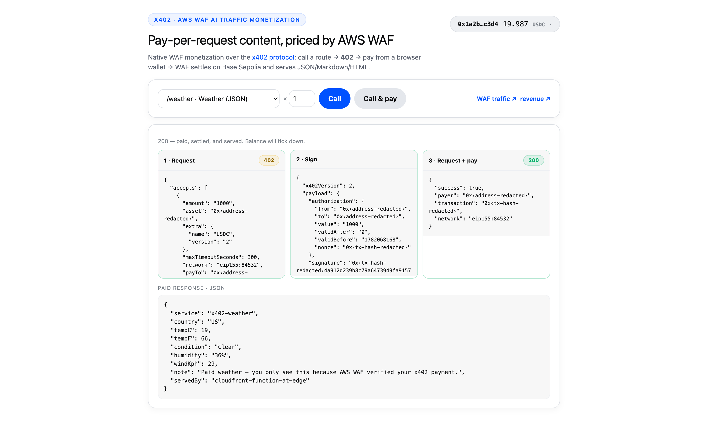
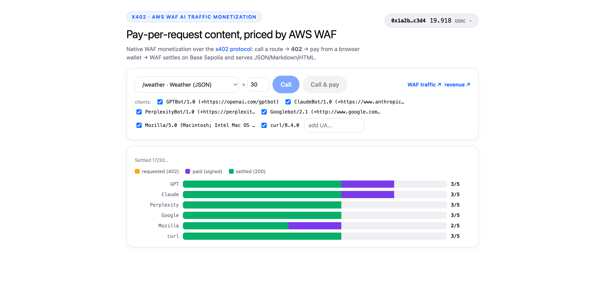
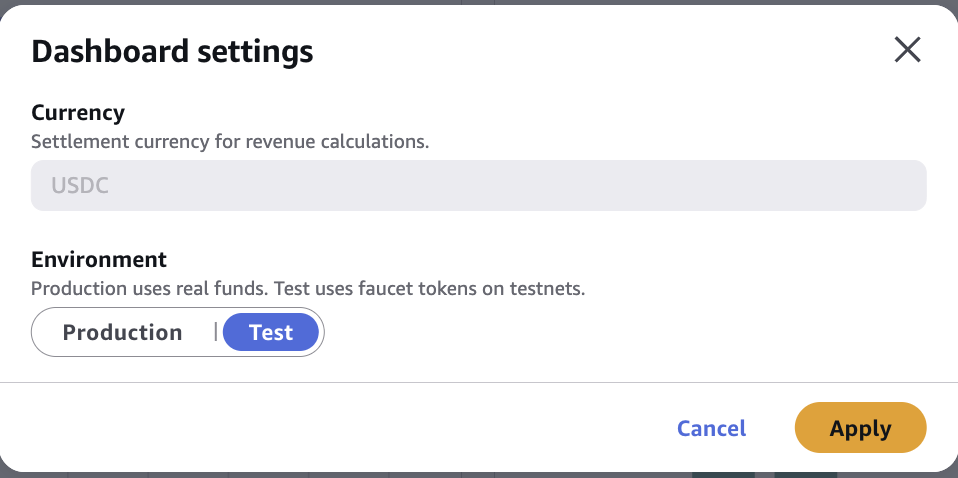

# Monetizing AI traffic with Amazon CloudFront and AWS WAF (x402)

A **minimal, one-`cdk deploy`** sample of **AWS WAF native AI Traffic Monetization** over the
[x402 protocol](https://www.x402.org/). AWS WAF puts a price on a content route at the edge: an unpaid
request gets a `402` straight from WAF; a paid request is verified and settled on Base Sepolia, then served
— all in one round-trip, with no Lambda@Edge and no origin code in the paywall.

The buyer is a single static page (React + TypeScript, built by CDK). It generates a throwaway wallet **in
your browser**, funds it from a testnet faucet, and pays the 402 using the official
[x402](https://www.x402.org/) client libraries — driven step by step so the challenge, the signed payload, and
the settlement receipt are each visible as their own leg. It can also burst traffic as different AI bots and
show it landing in the WAF console.

> **Testnet only** — Base Sepolia. The wallet is a throwaway key in your browser's localStorage; don't
> reuse it for real funds.

| One payment, anatomized | Many AI bots paying in parallel |
|---|---|
|  |  |

<sub>Left: **Call & pay** shows the three legs (request → sign → request + pay) and renders the paid response. Right: a parallel burst, one row per client, filling requested → paid → settled. (IDs anonymized.)</sub>

## Architecture

```
                 ┌──────────────────────── Amazon CloudFront ────────────────────────┐
   Browser  ───▶ │  AWS WAF (native x402)        CloudFront Function      S3 (static) │
   (buyer)       │  ├─ Bot Control v6 (Count → AI-traffic labels)         └─ the SPA  │
                 │  ├─ /            → allow (free)                                     │
                 │  ├─ /weather     → MONETIZE ─┐                                      │
                 │  ├─ /sports      → MONETIZE  ├─ no pay → 402 PAYMENT-REQUIRED       │
                 │  ├─ /main.html   → MONETIZE ─┘  valid pay → verify + settle ──▶ CFF │
                 │  └─ /proxy → Lambda (real-UA traffic generator, IAM + OAC)          │
                 └────────────────────────────────────────────────────────────────────┘

  Edge order is WAF → CloudFront Function → origin: WAF prices/verifies FIRST,
  so only a paid request reaches the function that generates the content.
```

One `cdk deploy` creates everything:

- **AWS WAF WebACL** (CLOUDFRONT scope) carrying the x402 posture itself — Bot Control v6 (Count, for
  AI-bot labels), a WebACL `MonetizationConfig` (payee + price + Base Sepolia), and one `Monetize` rule per
  route. These are real `AWS::WAFv2::WebACL` properties injected via `addPropertyOverride` (this
  `aws-cdk-lib` doesn't type them yet) — pure CloudFormation, **no custom resource, no runtime API call**.
- **CloudFront + S3** — `/` serves the SPA; each route runs a **CloudFront Function** that returns its
  content type (`/weather` JSON · `/sports` Markdown · `/main.html` HTML), *after* WAF verifies payment.
- **A UA-proxy Lambda** (`/proxy`, IAM Function URL + OAC) — browsers can't set `User-Agent` on `fetch`, so
  the traffic generator re-issues each request through this with a real bot UA, so WAF labels it genuinely.
- **A seller payTo** receiver address, generated once at deploy and cached locally.

Routes live in a registry (`cdk/lib/routes.ts`) — one entry adds a behavior, a Monetize rule, and an SPA
picker option.

## Quick start

Prereqs: an AWS account, credentials for **us-east-1**, Node 24+, and a CDK bootstrap.

```bash
cd cdk && npm install
npx cdk bootstrap            # first time in the account/region only
npx cdk deploy --outputs-file ../cdk-outputs.json
```

**See WAF price a request** (no wallet needed):

```bash
curl -i "$(jq -r '.X402WafSample.DistributionUrl' cdk-outputs.json)/weather"
# → HTTP/2 402  with a base64 PAYMENT-REQUIRED header (price, payTo, asset, network)
```

**Pay it in the browser** — open `DistributionUrl`:

1. The page auto-creates a wallet. Fund it from the wallet dropdown → the
   [Circle faucet](https://faucet.circle.com/) (Base Sepolia USDC; no gas needed).
2. Pick a route → **Call** to see the 402, or **Call & pay** to run the full round-trip and render the
   paid content.
3. Set the count > 1 and pick clients to **burst AI-bot traffic** through the proxy; the **WAF traffic** /
   **revenue** links open the AWS WAF AI-traffic console.

> **Seeing your revenue in the WAF console.** This sample settles on **Base Sepolia testnet**, and the
> revenue dashboard defaults to **mainnet**, so it shows **zero** until you switch it. In the WAF
> **AI revenue payments** dashboard open **Dashboard settings** and set **Environment** to **Test** —
> it re-queries with the testnet (`CurrencyMode: TEST`) filter and renders your payments (cards, chart,
> tables). See [Revenue analytics](https://docs.aws.amazon.com/waf/latest/developerguide/waf-ai-traffic-monetization-analytics.html).
>
> <p align="center">
>   
> </p>

**Teardown:** `cd cdk && npx cdk destroy`.

## Security

Testnet demo. The buyer key is generated in and never leaves the browser's localStorage; the seller payTo
keeps no private key (it only receives). The `/proxy` Lambda only re-issues GETs to the configured routes
and returns just the upstream status. Never put real funds or mainnet keys through this sample. Report
security issues per [CONTRIBUTING.md](CONTRIBUTING.md).

This sample settles crypto payments on a testnet and handles no payment-card data. If you adapt the pattern
to process card data or run a production payment system, meet [PCI-DSS](https://aws.amazon.com/compliance/pci-dss-level-1-faqs/)
and any applicable financial regulations.

## License

MIT-0. See [LICENSE](LICENSE).
